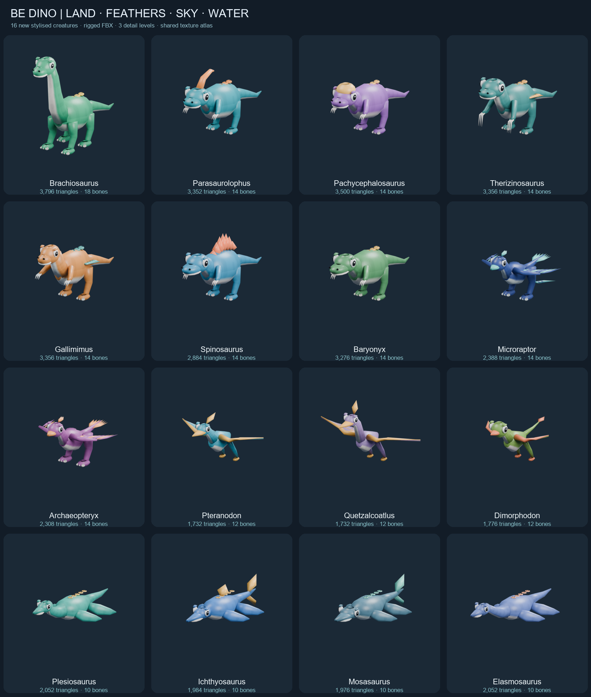
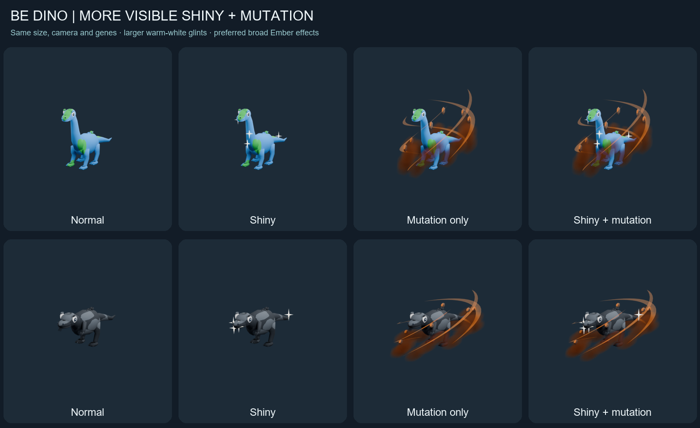

  

# Be Dino!

**Become a dinosaur. Grow on the island. Survive the arena. Hatch your next discovery.**

An original Roblox growth-and-collection game inspired by Be Fish. Start in a safe sanctuary, explore a mountainous island, gather food, grow, and eat smaller dinosaurs. Bank your run rewards, hatch new species and rare traits, then equip a dinosaur for your next adventure.

**Current build:** `redesign-020` · **Updated:** 8 October 2026 · **Stage:** Studio-tested private prototype; published/mobile acceptance remains open.

> The integrated Build 020 gameplay now lives on **[main](https://github.com/Znypr/be-dino/tree/main)**. See the [maintained integration checklist](docs/44-main-integration-checklist.md) for included updates and open acceptance gates. GitHub integration does not publish the Roblox experience. The owner-supplied logo above is the current main project image; the gallery below shows actual Studio gameplay.

[Download Build 020](build/BeDino-Build020.rbxlx) · [Current documentation guide](docs/00-documentation-guide.md) · [Creature integration and limits](docs/43-creature-runtime-integration.md) · [Live task tracker](docs/07-kanban.md)

## The vision

A bright dinosaur island where every run feeds a lasting collection. Growth creates the immediate challenge: find food, choose when to chase, survive larger dinosaurs and decide when to return. Eggs create the return journey: discover another species, reveal special traits, fuse duplicates and show off your dinosaur with auras and trails.

### Owner's intended reward experience (2026-10-08)

**Catches mean individual run eggs.** If a five-minute run yields **500 raw food points**, the current example conversion gives **15 catches = 15 run eggs** to reveal one at a time, e.g. **11 Common + 4 Uncommon**, plus some crystals and **1 bonus egg nest**. A larger **5,000-food-point** run example yields **150 run eggs** (80 Common, 50 Uncommon, 17 Rare, 3 Epic), **220 example crystals** and **6 offered nests** (at most 5 claimable with 5 free nest spots). The rarity mixes and crystal amounts are examples, **not final drop tables**. **Uncommon and Epic species rarity categories are not present in Build 020's current Common/Rare/Legendary catalog**; updating rarity taxonomy is part of the future reward design. Exact balance, large-batch UX and nest overflow policy remain open.

This is the **OWNER TARGET, NOT CURRENT BUILD BEHAVIOR**. Build 020 still grants legacy direct dinosaur-copy stacks and only 1/2/3 additional eggs through old catch thresholds. It is incorrect to describe that historical behavior as the target vision. See [reward target versus archived alpha](docs/09-reward-economy.md), [game design](docs/03-game-design.md), [AI/contributor rules](AGENTS.md), and [BD-044](docs/07-kanban.md). Do not change saves or reward code solely because the target has been documented.

The current art direction combines chunky creature silhouettes, textured island surfaces, colourful illustrated icons and layered 3D previews. Build 020 connects the authored creature models and egg to eight patterns, nine colour families and visible inherited two-tone genes. Broad mutation wisps and stronger white Shiny glints remain separate layers over the body. The [shared egg design vision](docs/39-egg-appearance-shared-vision.md) records the design; the [integration report](docs/43-creature-runtime-integration.md) distinguishes working Studio features from release checks.

## The player loop

1. Choose an owned dinosaur in the sanctuary and select **Explore Island**.
2. Gather food, grow, jump and use the special leap to explore.
3. Hunt smaller dinosaurs while avoiding larger ones. Spawn protection and sanctuary safety support the return loop.
4. **Target:** return or get eaten to bank your catches as **individual run eggs**, plus crystals and separate bonus nests. **Current Build 020:** catches are a reward score; direct copies and additional threshold eggs are still separate.
5. Watch earned eggs reveal individually after the run, approximately **five seconds per egg** in the current prototype, ascending in rarity within each batch. The target is to hatch **each caught egg**, not merely 1–3 threshold eggs.
6. Equip discoveries, fuse duplicate copies and use crystals in the current aura, trail and potion shops.

## What Build 020 can do

| System | Current capability |
|---|---|
| Island and movement | Mountainous terrain, food pickups, growing dinosaur rigs, safe sanctuary, Space jump and **E leap** with a 60-second cooldown. |
| Collection | **22 prehistoric creatures:** the original six plus 16 land, feathered, pterosaur and marine additions. New species enter hatching, collection and equipment with additive save migration. Flight/swimming abilities remain future gameplay work. |
| Rewards and hatching | Server-committed rewards, grouped duplicate counts, queued eggs and automatic post-run reveals. New eggs are ready immediately; closing the sequence preserves remaining eggs. Larger run egg batches improve rare-species odds. |
| Fusion | **50 Base → 1 Gold** and **50 Gold → 1 Diamond**. These are private-test prices. Individual variant selection remains pending. |
| Weather and events | Clear, Rain, Thunderstorm and Blizzard, plus **Volcano, Northern Lights, Earthquake and Blood Moon** events, visual effects and event mutation opportunities. Catch-time event metadata follows the egg into its reveal. |
| Genes and rare traits | Eight independent patterns; inherited two-colour coverage; matching-colour tonal contrast. **BIG:** 10%, **1.2×**, same stats. **Shiny:** 5% for special-event eggs, four visible warm-white world glints. Genes, BIG, Shiny and event mutation stack together. |
| Crystals and shops | Crystal rewards/map pickups, aura/potion shops, ten level-gated trails and condition progression. Random egg purchasing and configured Robux packs remain behind the paid-random release gate. |
| Sanctuary boards | Highest rarity obtained, total playtime and verified developer-product Robux spending. Local boards work; global persistence and real purchases remain unverified. Product IDs are configured; crystal packs are disabled. |
| Interface | Illustrated navigation/currency/weather/leap icons, layered shop previews, landscape phone-emulator layouts and reduced-effects options. |
| Saving and safety | Server-owned profiles, session leases and duplicate settlement/claim protection. Earlier builds passed persistence/security tests; newest additions still need published migration/rejoin verification. |

Details: [hatching and traits](docs/37-hatching-traits-and-leaderboards.md) · [events and visual upgrades](docs/35-event-mutations-and-visual-upgrade.md) · [canonical acceptance status](docs/07-kanban.md).

### Authored creatures and stacked appearances

These are Blender authoring previews of the assets integrated in Build 020, not Studio screenshots or phone FPS evidence.

New creature rigs use 916–2,010 triangles. Growth reuses the rig, genes repaint its existing image, and hidden index previews release their geometry. The new meshes currently use bounded EditableMesh creation because Studio mesh publishing was unavailable. Published API permission, static uploads and physical-phone profiling are still release checks.

## Latest gameplay gallery

**Build 019, captured in Studio on 8 October 2026.** Phone images are landscape emulator captures. Test currency and guaranteed rare rewards used disposable fixtures; these screenshots do not demonstrate natural drop frequency or normal earning rates.

### The island and current HUD

### Weather changes the atmosphere

| Northern Lights | Blood Moon |
|---|---|
|  |  |

### Customisation and discoveries

| Aura Shop | Shiny + BIG reveal on phone |
|---|---|
|  |  |

### Sanctuary leaderboards

Full evidence: [events/cosmetics](docs/evidence/2026-10-08-events-and-cosmetics/README.md) · [hatching/boards](docs/evidence/2026-10-08-hatching-and-leaderboards/README.md) · [weather/leap](docs/evidence/2026-10-08-weather-and-leap/README.md) · [icons/acceptance](docs/evidence/2026-10-08-icons-and-acceptance/README.md).

### New long-term progression target: individual dinosaurs and pattern fusion (planned)

The owner now wants **species-and-pattern-specific fusion** rather than a flat `50 Base → Gold; 50 Gold → Diamond` grind. Prototype: **ten Compies with the same saved stripe pattern → one Gold Striped Compy**, preserving a selected hero instance's colors/condition/Shiny/BIG/egg origin; **Emerald follows Gold and precedes Diamond**, with additional premium materials under review. This is **owner intent, not Build 020 behavior**. Gold/Emerald/Diamond need Blender-authored **subtle and medium gloss/crystal overlays** that preserve the underlying genetics while stacking Shiny, event mutation, aura and trail. Fusion should be the **main deterministic stat booster**, not a new random-drop roll.

Auras/trails will be **purchased for individual dinosaur instances** and freely switched among already purchased styles on that dino, without transferring cosmetics to other dinos. The picker needs stable instance IDs, original egg previews, DNA, traits, fusion stage, per-dino aura/trail loadouts and truthfully distinguished **natural hatch odds versus crafted earned prestige**. Purchased cosmetics are not part of the combined rarity. Pattern research/duplicate conversion is proposed as a deterministic parallel route to reduce bad luck in exact-pattern fusion. See [full specification](docs/46-pattern-fusion-dino-identity-and-cosmetic-progression.md) and [BD-057–063](docs/07-kanban.md).

## Where the project goes next

The next milestone is a **small, complete private community test**, supported by the remaining device, multiplayer, asset and persistence checks.

The [progression design](docs/36-crystal-shops-egg-genetics-and-progression.md) now has implementations for account levels, ten trails, conditions and colour inheritance. The remaining work includes:

- **BD-044:** Replace legacy direct-copy plus 1/2/3 threshold egg payouts with **one run egg per catch**, separate bonus nests and crystal payouts. Add 5-slot nest claiming, 150-egg reveal/performance acceptance and safe data migration; details in the [target economy](docs/09-reward-economy.md).
- Production balance and paid-random disclosure/receipt verification before enabling egg purchases or Robux packs.
- Published migration/rejoin, real phones, non-owner assets and multiplayer load acceptance.
- Species abilities and habitats that make flying/marine discoveries change how the game plays.
- An authored 3D egg split, modular condition overlays and further art approval.

The larger retention and release roadmap remains open; adding creature variety alone does not complete it. See the tracker for acceptance status.

## Try the prototype

1. Use the current **main** branch and download [BeDino-Build020.rbxlx](build/BeDino-Build020.rbxlx) (or the checked-in `build/BeDino-Latest.rbxlx`).
2. Open it in Roblox Studio and keep the first test unpublished. No plugin is required.
3. Press Play and confirm **BUILD redesign-020**. Unpublished preview sessions explicitly say progress is not saved and may use replenishing test currency. Read the [Build 020 API/device limits](docs/43-creature-runtime-integration.md) before publishing.
4. Explore, gather food, leap, return, hatch and inspect the collection/shops. Read the [latest handoff](docs/34-studio-handoff.md) alongside the [tracker](docs/07-kanban.md); older build instructions may be superseded.

**Verified so far:** earlier desktop gameplay, multiplayer, save/rejoin and transaction tests passed. Recent disposable Studio sessions exercised shops, fusion, six-species movement, event visuals, HUD states, ordered hatching and local boards on desktop and phone emulator. Offline checks cover compilation, gameplay/progression logic, artwork bindings and packaging.

**Still open:** physical-phone touch/performance, current multiplayer/load and maximum BIG physics, non-owner published asset access, newest persistent migration/rejoin, global leaderboard ranking, real purchases and final art approval. Screenshots and offline checks do not close these gates. See the tracker for their current status.

## Project guide

| Looking for… | Start here |
|---|---|
| Which document is authoritative? | [Current documentation and archive guide](docs/00-documentation-guide.md) |
| Tasks and acceptance evidence | [Canonical Kanban](docs/07-kanban.md) |
| Latest build setup and adjustments | [Build 020 handoff](docs/34-studio-handoff.md) |
| Rules and rewards | [Game design](docs/03-game-design.md) · [Reward economy](docs/09-reward-economy.md) |
| Code and persistence | [Build 020 integration](docs/44-main-integration-checklist.md) · [Historical architecture](docs/04-architecture.md) · [Persistence contract](docs/13-persistence-remote-contracts.md) |
| Artwork and runtime assets | [Resources](resources/README.md) · [Artwork direction](docs/32-artwork-guide-and-todo.md) |
| Combined egg appearance and trait decisions | [Shared egg vision: patterns, colors, rarity, conditions and mutations](docs/39-egg-appearance-shared-vision.md) |
| Future progression | [Crystal shops and egg genetics](docs/36-crystal-shops-egg-genetics-and-progression.md) · [New Shop/UI/World/Weather tasks](docs/45-owner-feedback-shop-hud-world-weather-tasks.md) |
| Release criteria | [Roadmap and testing](docs/06-roadmap-and-testing.md) |

GitHub is the source of truth for plans and code. Gameplay state belongs to the server. The prototype uses original assets and free tools with a **€0 production budget**.
