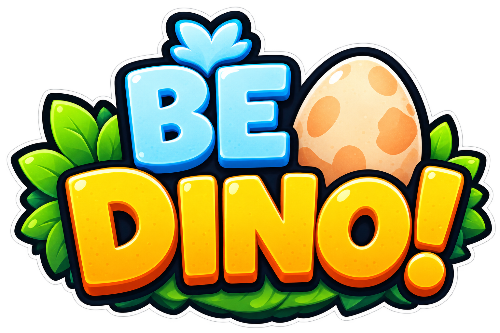
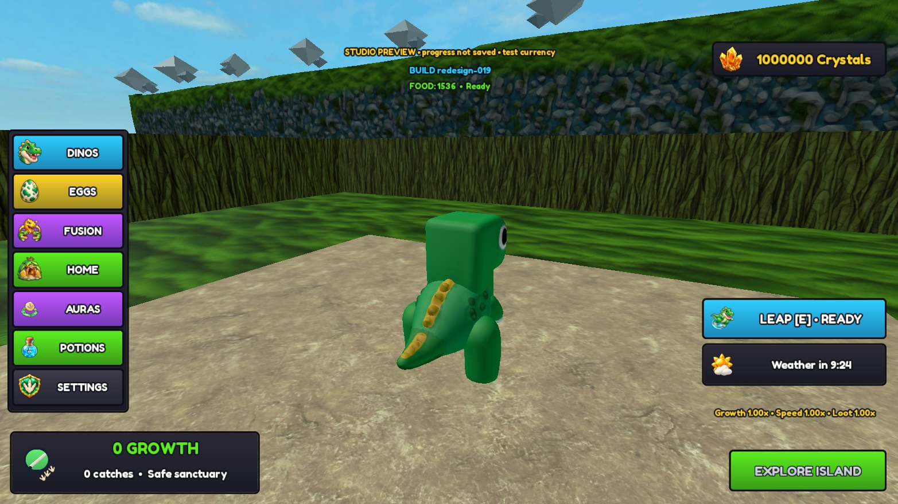
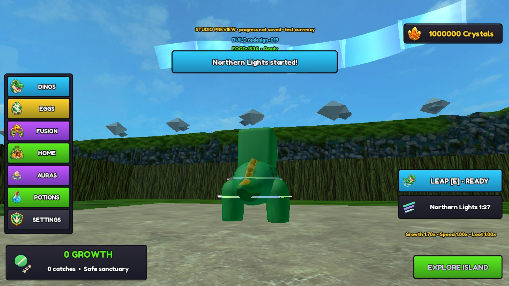
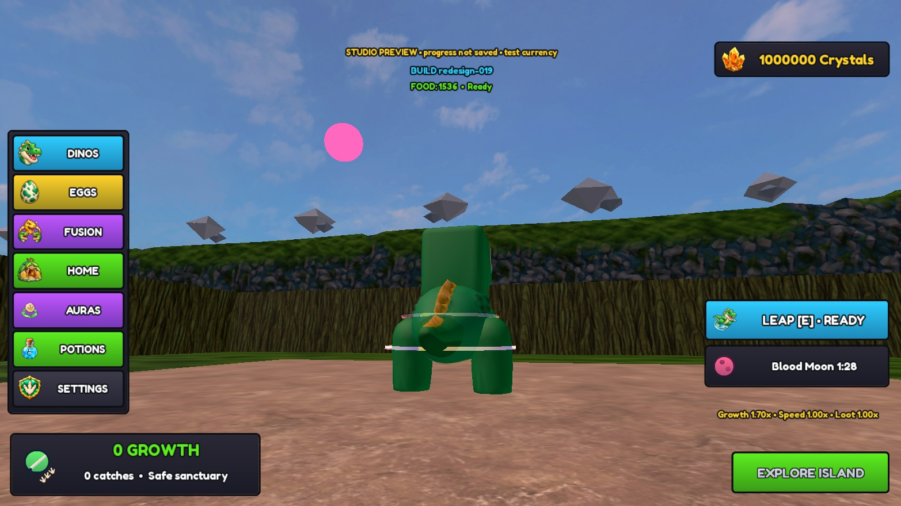
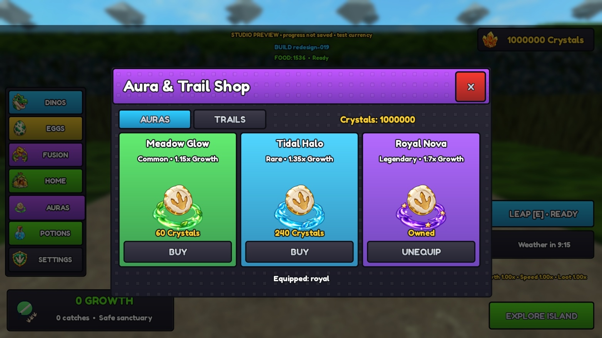
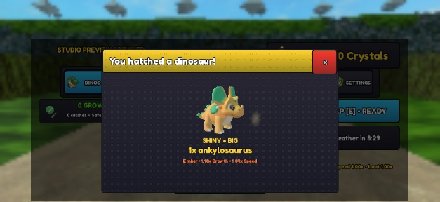
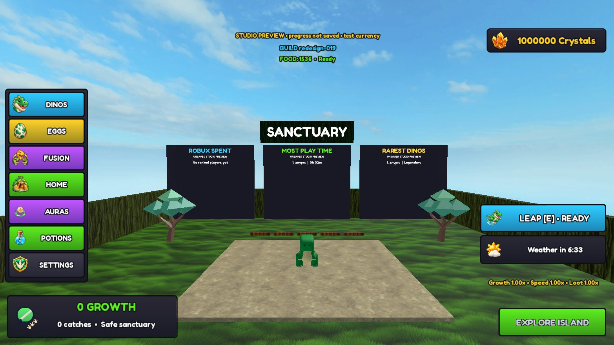

  

# Be Dino!

**Become a dinosaur. Grow on the island. Survive the arena. Hatch your next discovery.**

An original Roblox growth-and-collection game inspired by Be Fish. Start in a safe sanctuary, explore a mountainous island, gather food, grow, and eat smaller dinosaurs. Bank your run rewards, hatch new species and rare traits, then equip a dinosaur for your next adventure.

**Current build:** `redesign-019` · **Updated:** 8 October 2026 · **Stage:** private-test prototype with partial Studio acceptance.

> The latest gameplay lives on **[redesign/resources-and-core-fixes](https://github.com/Znypr/be-dino/tree/redesign/resources-and-core-fixes)**. `main` currently has an older baseline. The owner-supplied logo above is the current main project image; the gallery below shows actual Studio gameplay.

[Download Build 019](build/BeDino-Build019.rbxlx) · [Studio handoff](docs/34-studio-handoff.md) · [Live task tracker](docs/07-kanban.md)

## The vision

A bright dinosaur island where every run feeds a lasting collection. Growth creates the immediate challenge: find food, choose when to chase, survive larger dinosaurs and decide when to return. Eggs create the return journey: discover another species, reveal special traits, fuse duplicates and show off your dinosaur with auras and trails.

The current art direction combines chunky dinosaur silhouettes, textured island surfaces, glossy illustrated icons, colourful navigation and layered 3D previews. Dinosaur and environment art are still drafts; the logo sets the branding direction.

## The player loop

1. Choose an owned dinosaur in the sanctuary and select **Explore Island**.
2. Gather food, grow, jump and use the special leap to explore.
3. Hunt smaller dinosaurs while avoiding larger ones. Spawn protection and sanctuary safety support the return loop.
4. Return or get eaten to settle eligible collection rewards and eggs. **Catches are reward-score units**, separate from growth and egg count.
5. Watch new eggs reveal automatically after the run, approximately **five seconds per egg**, ascending in rarity within each run batch.
6. Equip discoveries, fuse duplicate copies and use crystals in the current aura, trail and potion shops.

## What Build 019 can do

| System | Current capability |
|---|---|
| Island and movement | Mountainous terrain, food pickups, growing dinosaur rigs, safe sanctuary, Space jump and **E leap** with a 60-second cooldown. |
| Collection | **Compy, Triceratops, T-Rex, Raptor, Stegosaurus and Ankylosaurus**, with owned/locked entries and 3D previews. |
| Rewards and hatching | Server-committed rewards, grouped duplicate counts, queued eggs and automatic post-run reveals. New eggs are ready immediately; closing the sequence preserves remaining eggs. Larger run egg batches improve rare-species odds. |
| Fusion | **50 Base → 1 Gold** and **50 Gold → 1 Diamond**. These are private-test prices. Individual variant selection remains pending. |
| Weather and events | Clear, Rain, Thunderstorm and Blizzard, plus **Volcano, Northern Lights, Earthquake and Blood Moon** events, visual effects and event mutation opportunities. Catch-time event metadata follows the egg into its reveal. |
| Rare traits | **BIG:** 10% chance, 1.3× visual size, no speed/growth bonus. **Shiny:** 5% for special-event eggs, preview glints/badges. Both can coexist; world Shiny shimmer is still pending. |
| Crystals and shops | Crystal wallet/map pickups, aura purchase/equip, three cosmetic trails, and speed/growth potion flows. Expanded progression shops remain planned. |
| Sanctuary boards | Highest rarity obtained, total playtime and verified developer-product Robux spending. Local boards work; global persistence and real purchases remain unverified. Paid product IDs are unconfigured. |
| Interface | Illustrated navigation/currency/weather/leap icons, layered shop previews, landscape phone-emulator layouts and reduced-effects options. |
| Saving and safety | Server-owned profiles, session leases and duplicate settlement/claim protection. Earlier builds passed persistence/security tests; newest additions still need published migration/rejoin verification. |

Details: [hatching and traits](docs/37-hatching-traits-and-leaderboards.md) · [events and visual upgrades](docs/35-event-mutations-and-visual-upgrade.md) · [canonical acceptance status](docs/07-kanban.md).

## Latest gameplay gallery

**Build 019, captured in Studio on 8 October 2026.** Phone images are landscape emulator captures. Test currency and guaranteed rare rewards used disposable fixtures; these screenshots do not demonstrate natural drop frequency or normal earning rates.

### The island and current HUD

### Weather changes the atmosphere

| Northern Lights | Blood Moon |
|---|---|
|  |  |

### Customisation and discoveries

| Aura Shop | Shiny + BIG reveal on phone |
|---|---|
|  |  |

### Sanctuary leaderboards

Full evidence: [events/cosmetics](docs/evidence/2026-10-08-events-and-cosmetics/README.md) · [hatching/boards](docs/evidence/2026-10-08-hatching-and-leaderboards/README.md) · [weather/leap](docs/evidence/2026-10-08-weather-and-leap/README.md) · [icons/acceptance](docs/evidence/2026-10-08-icons-and-acceptance/README.md).

## Where the project goes next

The next milestone is a **small, complete private community test**, supported by the remaining device, multiplayer, asset and persistence checks.

The [next progression design](docs/36-crystal-shops-egg-genetics-and-progression.md) proposes:

- Expanded crystal earning and a random-egg shop with configurable rewards and reviewed odds.
- Persistent account levels and **ten level-gated trail tiers**, ending with Astra.
- A Condition Shop and deeper egg genetics: shell patterns, weighted two-colour blends and inherited dinosaur colours.
- Production-quality modular egg artwork and richer special-variant visuals.
- Optional Robux crystal packs after receipt/storefront verification.

These are **design/Todo items, BD-035–041**. Existing Shiny/BIG traits and three trails do not complete this larger roadmap.

## Try the prototype

1. Use the current redesign branch and download [BeDino-Build019.rbxlx](build/BeDino-Build019.rbxlx).
2. Open it in Roblox Studio and keep the first test unpublished. No plugin is required.
3. Press Play and confirm **BUILD redesign-019**. Unpublished preview sessions explicitly say progress is not saved and may use replenishing test currency.
4. Explore, gather food, leap, return, hatch and inspect the collection/shops. Read the [latest handoff](docs/34-studio-handoff.md) alongside the [tracker](docs/07-kanban.md); older build instructions may be superseded.

**Verified so far:** earlier desktop gameplay, multiplayer, save/rejoin and transaction tests passed. Recent disposable Studio sessions exercised shops, fusion, six-species movement, event visuals, HUD states, ordered hatching and local boards on desktop and phone emulator. Offline checks cover compilation, gameplay/progression logic, artwork bindings and packaging.

**Still open:** physical-phone touch/performance, current multiplayer/load and maximum BIG physics, non-owner published asset access, newest persistent migration/rejoin, global leaderboard ranking, real purchases and final art approval. Screenshots and offline checks do not close these gates. See the tracker for their current status.

## Project guide

| Looking for… | Start here |
|---|---|
| Tasks and acceptance evidence | [Canonical Kanban](docs/07-kanban.md) |
| Latest build setup and adjustments | [Build 019 handoff](docs/34-studio-handoff.md) |
| Rules and rewards | [Game design](docs/03-game-design.md) · [Reward economy](docs/09-reward-economy.md) |
| Code and persistence | [Architecture](docs/04-architecture.md) · [Profile/remote contracts](docs/13-persistence-remote-contracts.md) |
| Artwork and runtime assets | [Resources](resources/README.md) · [Artwork direction](docs/32-artwork-guide-and-todo.md) |
| Future progression | [Crystal shops and egg genetics](docs/36-crystal-shops-egg-genetics-and-progression.md) |
| Release criteria | [Roadmap and testing](docs/06-roadmap-and-testing.md) |

GitHub is the source of truth for plans and code. Gameplay state belongs to the server. The prototype uses original assets and free tools with a **€0 production budget**.
