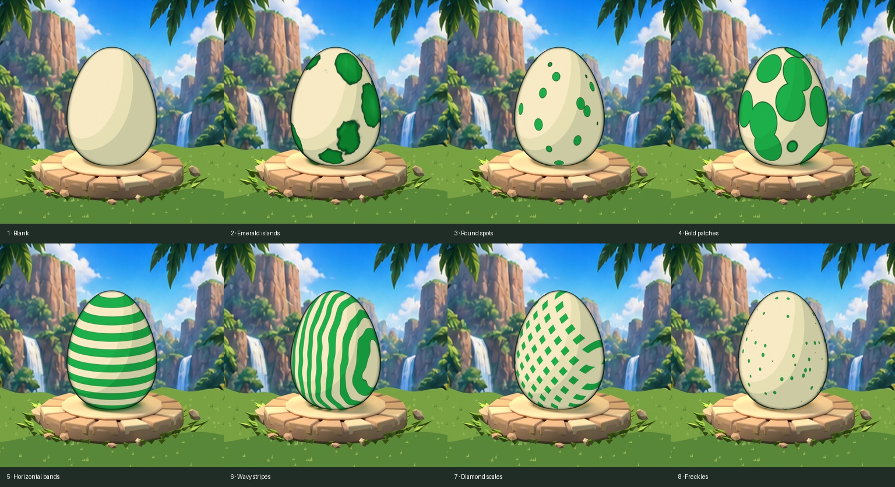
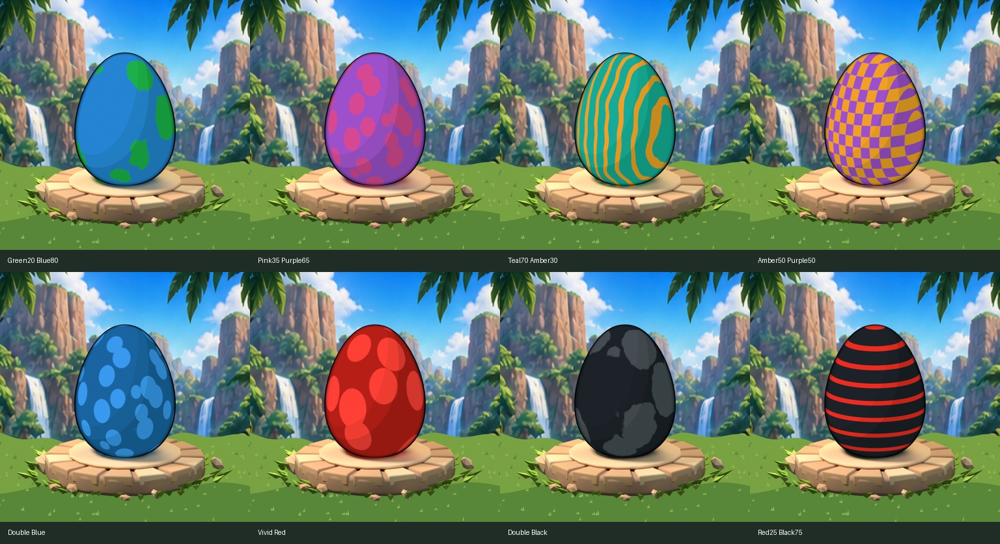
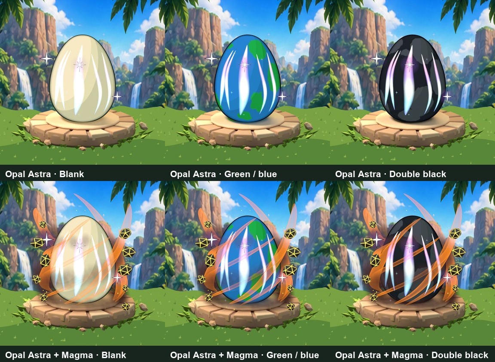
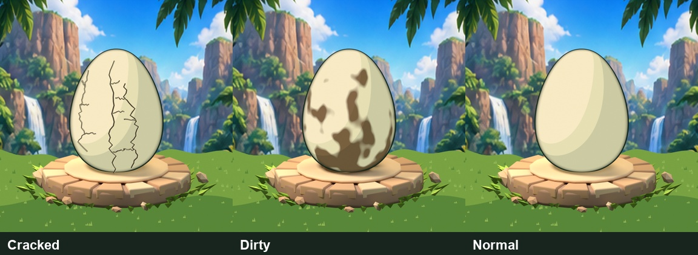
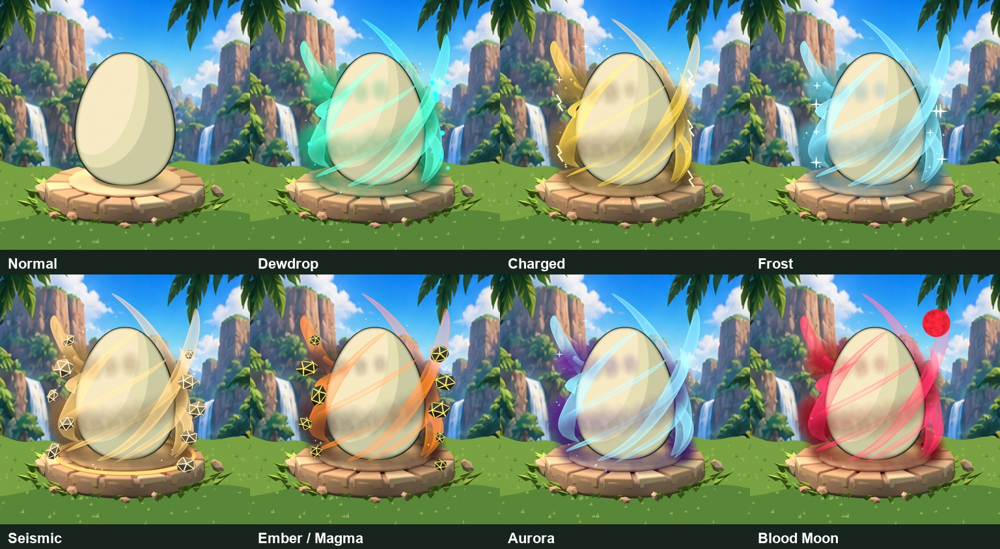

# Egg appearance: shared design vision

**Updated:** 2026-10-08. Owner decisions from the Blender egg design review.
**Scope:** the combined visual contract for eggs, genetics, conditions and event mutations.
This supplements [artwork production](32-artwork-guide-and-todo.md), [event mechanics](35-event-mutations-and-visual-upgrade.md) and [progression/genetics](36-crystal-shops-egg-genetics-and-progression.md). It supersedes their older conflicting egg-art instructions. It does not change gameplay code, approve public drop odds or certify runtime integration. Track delivery under BD-035, BD-040 and BD-041 in [Kanban](07-kanban.md).

## One collectible identity, several independent traits

An egg combines **one shell silhouette + one of eight patterns + two color genes and their percentage + one condition + any event mutation**, with independent Shiny and Normal/Big traits where supported. Keep these as separate stored attributes and reusable visual layers. A black egg can still have spots, dirt and a Magma aura; a blue/blue egg can still have stripes. Neither color nor pattern changes its species or automatically grants a mutation.

Species rarity, color rarity, condition tier, event mutation, fusion material and shop aura/trail tier are different systems. Keep their labels and data separate. Gold/Diamond fusion treatments remain governed by existing progression rules; they are not new shell patterns. Purchased dinosaur auras such as Meadow/Tidal/Royal are separate from the surrounding **event-mutation aura** described here. The Astra condition and Astra trail also remain separate products/traits.

## Art direction and presentation

The game is a friendly Roblox dinosaur collectible experience aimed at younger players. Eggs should look matte, illustrated and rounded, with broad directional shading, a readable dark contour and restrained highlights. The owner rejected glossy realistic porcelain and flat simplistic effects. Keep dimensional geometry, but use an overall illustrated, more 2D shell treatment rather than photoreal surface detail.

Use the project's cream/ivory, emerald/leaf-green and amber identity, extending the shell palette deliberately. Preserve the canonical `Egg_Master` silhouette and the locked camera across variants. Do not redraw a different egg for every trait.

Review images retain the stone floor tile. Ground it with matching grass across the lower section of the landscape; a platform floating over water was rejected. The jungle/mountain background and tile belong to the presentation stage, not to reusable shell or effect PNGs. Do not bake UI text, rarity frames, percentages or reward promises into the artwork. Judge readability at 128px, with additional 64/48px UI checks.

## Eight patterns, including blank

Pattern identity is independent of color. The current authored set is:

| Authoring ID | Pattern | Visual identity |
|---|---|---|
| `01_blank` | Blank | Clean shell, no decorative motif |
| `02_emerald_islands` | Islands | Broad irregular island patches; the historical name does not lock it to green |
| `03_round_spots` | Round spots | Bold rounded spots |
| `04_bold_patches` | Bold patches | Large contrasting patches |
| `05_horizontal_bands` | Horizontal bands | Broad horizontal bands |
| `06_wavy_stripes` | Wavy stripes | Flowing stripes |
| `07_diamond_scales` | Diamond scales | Repeating diamond-scale motif |
| `08_freckles` | Freckles | Smaller scattered marks that remain readable |

These are artwork IDs, not a claim that production profile IDs are already migrated. The owner requested eight complete patterns including blank; the rendered pattern set establishes that direction. No pattern rarity hierarchy was requested. Uniform pattern weights in the authoring demonstration are provisional. Cracked is a **condition**, not a ninth pattern in this set; reconcile any legacy cracked-pattern IDs explicitly.

## Color hierarchy, mixing and rare pure colors

Confirmed direction: colors have a rarity hierarchy; vivid red is rare and full black is exceptionally rare. Draw two color genes, then save a random coverage proportion. **20% green / 80% blue** means two visible color regions/tones covering approximately those shares, rather than averaging both into one uniform RGB tint. Placement depends on the pattern and mesh; antialiasing means measured visible coverage is approximate.

If both genes match, the egg is **100% that color family**. Keep the selected pattern visible through tonal contrast: double blue uses distinguishable blue tones, and double black uses near-black and lighter charcoal. A literal all-zero RGB fill would erase the pattern and is unsuitable. Blank remains unpatterned; a mixed blank may use broad two-tone coverage without acquiring spots or stripes.

The Blender authoring draft uses these configurable starting weights:

| Draft group | Color families | Weight per color |
|---|---|---:|
| Common | Cream, green, blue | 100 |
| Uncommon | Teal, pink | 40 |
| Rare | Purple, amber | 15 |
| Very rare | Vivid red | 4 |
| Extremely rare | Black | 1 |

**The hierarchy is the design direction; these exact weights, group labels and probabilities are not approved production balance.** Cream/ivory is the neutral artwork anchor; reconcile the gameplay palette's white ID rather than creating competing neutral IDs without migration.

For the authoring demonstration only, draw colors independently and choose an integer first-color share from **1–99% for different colors**; use 100% for a matching pair. Excluding mixed-pair endpoints preserves the exceptional rarity of pure colors. At total weight 415, pure black is `(1/415)^2`, or **1 in 172,225**; pure vivid red is `(4/415)^2`, approximately **1 in 10,764**. These are illustrative calculations, not advertised live odds or observed drop rates. Final distribution and endpoint behavior require explicit gameplay reconciliation; the older generic 0–100% blend proposal must not silently bypass pure-color rarity.

Persist the server-selected pair and percentage once. Egg and dinosaur use the same saved genes; previews, hatch retries and recoloring must not reroll them. Deterministic placement on dinosaur meshes remains an implementation task. No color stat bonus is specified. Do not collapse color rarity into the species rarity frame.

## Conditions preserve the underlying shell

The accepted basic visual progression is **Cracked → Dirty → Normal**. Cracked uses dark, non-glowing fractures/chipped detail; Dirty uses matte earthy smudges; Normal is clean and intact. Cracks and dirt are separate transparent effect pixels that can be layered over any color/pattern. They must not supply an opaque replacement egg or erase its genetics.

**Rainbow/Astra rework resumed and Astra's latest visual direction was accepted by the owner.** Initial rainbow-gradient and indigo celestial shell recolors were rejected because they covered underlying colors. These remain historical backups. Current effects are transparent highlights/sparkles over the independently chosen shell.

- **Rainbow:** stronger prismatic flank and center highlights with multicolored stars, without black outlines. Keep this identity distinct from Astra; the current authored Rainbow remains subject to final combination/runtime review.
- **Astra:** owner accepted **five bright, curved vertical opal streaks**, shifting icy white/cyan/violet/soft pink, with three hero stars, medium black outlines, restrained violet halos and sparse smaller glints. One hero is an eight-point north star. Crossing/diagonal condition streaks were rejected. Earlier dense bold-star, first opal and crossing-streak versions are preserved as backups. Current local source: `Premium_Egg/Astra_Curved_Vertical/BeDino_Astra_Vertical.blend`, collection 86.
- Opaque black star-outline pixels are allowed; an opaque replacement egg is not. Most shell pixels remain untouched, and selected colors/patterns must stay readable. Orange diagonal wisps in Magma comparisons belong to the mutation, not Astra.
- Assign one condition per egg. Dirty/Cracked/Rainbow/Astra are alternatives; each may coexist with its pattern, saved color genes and event mutation. Do not interpret composition tests as stacking two stat-bearing conditions.

The already-confirmed mechanics remain in [the condition design](36-crystal-shops-egg-genetics-and-progression.md#egg-condition-shop-permanent-odds-upgrades): Cracked has 20% hatch success and 0.8x movement speed/growth intake on success; Dirty 0.8x, Normal 1.0x, Rainbow 1.2x and Astra 1.8x, subject to shared caps. This art review neither rebalances those factors nor proves implementation. Condition-shop odds and failed-hatch consolation remain separate gameplay work. A Normal condition can still coexist with any pattern, color or mutation.

## Event mutations are engulfing elemental auras

The latest request supersedes painted lava seams, shell symbols and thin flat halo drafts. **Mutation identity belongs around the egg**, using engulfing smoke/mist, flowing anime-like energy, particles and dimensional floating fragments. Smoke and curled tendrils should pass behind the egg and partially across its lower front. The base remains readable; empty outer glow rectangles, an opaque second shell, full-shell recolors and a uniform flat ring are unsuitable.

Combine volumetric or convincingly layered smoke, broad tapered wisps, controlled bloom and variation in depth/scale. Do not replace the matte shell with a glossy realistic material to make VFX brighter. Foreground smoke may overlap shell pixels naturally; the earlier entirely clear-center layout is no longer a strict requirement. Keep the pattern and color identifiable through the effect.

| Existing event ID | Mutation | Elemental direction |
|---|---|---|
| `dewdrop` | Dewdrop | Teal/green vapor, flowing mist and floating droplets |
| `charged` | Charged | Storm smoke with gold electric energy and airborne bolts |
| `frost` | Frost | Pale cyan icy mist, cold wisps and ice glints |
| `seismic` | Seismic | Earthy dust, dimensional floating fractured rocks and grounded shock energy |
| `ember` | Ember / Magma reference | Smoky orange/yellow heat, embers and volcanic rocks with luminous interiors |
| `aurora` | Aurora | Cyan/green/violet flowing light and atmospheric smoke |
| `bloodmoon` | Blood Moon | Crimson smoke, red energy and a separate moon accent |

Magma is the supplied visual reference for existing **Ember**, not a new gameplay ID. Cosmic and Eclipse were also in the reference sheet; they do not automatically add catalog entries. Current artwork covers the existing seven event mutations. Their weather eligibility, chance and perks remain in `ProgressionConfig` and [event documentation](35-event-mutations-and-visual-upgrade.md), separate from color probabilities and art intensity. A preview must reflect committed metadata rather than promise a mutation the server has not granted.

The latest `.blend` uses procedural volume smoke in a world-space spiral and tapered translucent geometry. It is a static render setup, not a cached animated fluid simulation or a verified Roblox VFX implementation. It remains a **review draft**, not owner-approved final art. Runtime equivalents must retain the depth/readability while fitting phone performance and reduced-effects settings. Do not import the entire high-detail Blender smoke setup as runtime geometry by default.

## Composition and export contract

Use separate background, tile, shell/color/pattern, condition, mutation and Shiny parts. In a live 3D preview, put rear aura geometry behind the egg and foreground VFX in front. A reusable 2D layout conceptually reads **background → tile → rear aura → colored/patterned egg → condition pixels → front aura/glow → Shiny/UI**. Its actual implementation may use a full effect-only render with the egg acting as a holdout occluder; rear and foreground parts are not yet separate PNG deliveries in the latest batch.

- Save a new working copy and preserve prior versions before editing. Keep `Egg_Master` vertex positions/silhouette, camera transform, framing and canvas registration consistent. Name collections and keep unrelated/deferred variants hidden.
- Render internally at **1024 × 1024**, export genuine **512 × 512 RGBA PNGs**. Contact sheets are review evidence; individual aligned PNGs are runtime sources. Preserve full canvases rather than independently cropping effects.
- Surface overlays contain only effect pixels, not an opaque second egg. Authored full-egg pattern/color previews are valid review sources but do not, by themselves, complete a dynamic pattern-only runtime pass.
- Smoke/ring/rock/ember/glow parts remain separately editable. The current anime batch exports one combined transparent aura per event; finer pass splits and live animation remain integration work. Use Blender 5.1-compatible nodes and compositor bloom.
- Actually render, visually inspect, refine and check resolution, alpha, edge clipping and alignment. Verify every shell mask against the canonical silhouette. Test overlays over patterned eggs, double blue and double black, plus Shiny/size combinations. Do not declare completion from node edits alone.
- Shared scaling must keep all layers registered. Current private-test genetics integration uses 1.2x BIG and independent Shiny per [shop/genetics acceptance](39-crystal-shops-and-genetics-acceptance.md); the earlier 1.3x hatch baseline is historical. These Blender renders do not certify authored-layer size/Shiny integration in Studio.

## Current decision and delivery status

| Area | Status |
|---|---|
| Matte illustrated shell, canonical silhouette, grounded tile/grass | Accepted direction |
| Eight patterns including blank | Requested set authored/rendered; not a runtime migration acceptance |
| Two colors, random shares, rare vivid red / exceptional pure black, same-color pattern contrast | Confirmed direction; exact balance/production distribution provisional |
| Cracked and Dirty reusable overlays; clean Normal | Accepted visual direction |
| Rainbow condition effects | Current prismatic/multicolored-star authoring direction; final combination/runtime review open |
| Astra condition effects | Owner accepted brighter opal with five curved vertical streaks and three hero stars; runtime integration still open |
| Smoky engulfing anime mutation auras | Latest requested direction; seven latest renders remain review drafts |
| Roblox upload, ID binding, layered runtime/phone testing | Not completed by the Blender review |

The [evidence README and manifest](evidence/2026-10-08-egg-shared-vision/README.md) identify the preview files, local editable source lineage and render validation. Full `.blend` projects and complete individual export packs remain in the local `Premium_Egg` workspace; only compact review examples and validation records are archived here. Do not assume local-only sources are downloadable from this repository.

Latest authoring combination review: green/blue Islands with Normal, Dirty and Cracked + Magma; double-blue spots with Dirty, Cracked and Astra + Magma; double-black Islands with Rainbow/Astra + Magma. [Review images and layer validation](evidence/2026-10-08-egg-condition-combinations/README.md) cover this bounded sample, not every trait combination or a Studio acceptance pass.

Subsequent [Magma and Cracked revisions](evidence/2026-10-08-magma-cracked-revision/README.md) are authored and rendered, **awaiting owner review**. Magma uses chunky matte charcoal rocks with narrower orange molten seams, heated side/floor smoke, fewer crossing wisps, tiny drifting embers, and a broken molten ring. Its combined transparent aura and separate smoke/wisp/rock/ember/ring/glow PNGs preserve the camera and egg. Cracked uses wider charcoal fractures with a pale chipped edge that remains visible on double black. The original aura and Cracked collections are retained as backups; these drafts do not supersede accepted direction or certify Roblox integration. The new 128px checks retain readable shell colors, Astra highlights, and Cracked lines through Magma.

Next work: approve/refine mutation silhouettes; reconcile remaining visual palette/profile differences with private-test gameplay; produce missing granular runtime layers and upload manifests; then verify authored combinations, Shiny/Big and device performance in Studio. Keep accepted direction, authored draft, uploaded, integrated and runtime-verified states distinct.

Latest Magma feedback: the owner prefers the volcanic revision and requests **yellow heat alongside orange** and **finer dark debris within the smoke**, retaining the larger rock chunks. [The color/debris render revision](evidence/2026-10-08-magma-color-debris/README.md) adds golden filament cores, golden smoke pockets, a hot yellow inner ring, pale sparks, and 74 smaller irregular charcoal chips. Its eleven aligned exports include a separate fine-debris layer. This revision is awaiting owner review; the previously preferred version is preserved as backup.

Gameplay reconciliation follow-up: [the outcome contract](41-egg-outcomes-contract.md)
selects provisional equal pattern weights and a nine-color next-build palette with
1-99 mixed shares / 100 matching shares. It preserves legacy genes and documents
complete disclosure requirements. These fill design gaps but do not claim palette,
pattern, authored Astra or smoke-layer integration in the current runtime.
