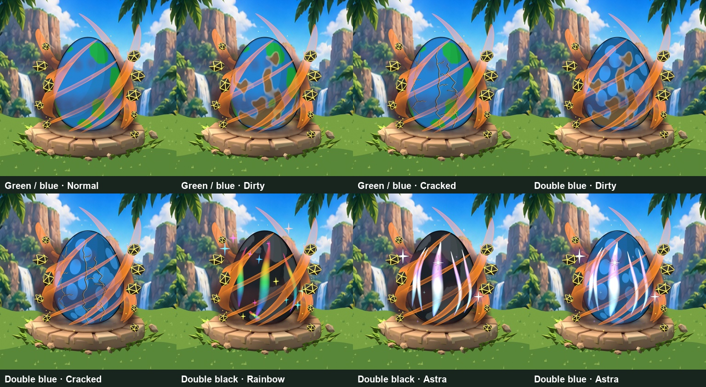
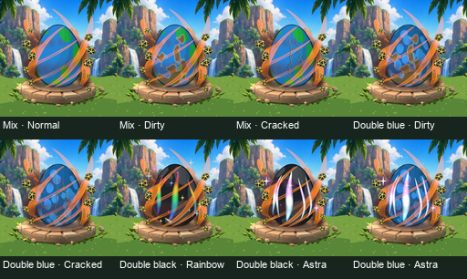

# Accepted Astra and combined egg review

2026-10-08. Follow-up to [the shared egg vision](../../39-egg-appearance-shared-vision.md). The owner said "thats fine keep this" for Astra's bright five curved vertical opal highlights. Three hero stars, medium outlines, faint halos and sparse colored glints complete the selected look. Crossing condition streaks are rejected. Earlier bold-star and opal iterations are preserved locally as backups. Rainbow keeps colored stars without black outlines.

## Bounded combination test

Eight actual Blender renders, all with Magma/Ember:

1. Green/blue Islands + Normal.
2. Green/blue Islands + Dirty.
3. Green/blue Islands + Cracked.
4. Double-blue round spots + Dirty.
5. Double-blue round spots + Cracked.
6. Double-black Islands + Rainbow.
7. Double-black Islands + accepted Astra.
8. Double-blue round spots + accepted Astra.

Dirty's broad smudges, Rainbow's colored highlights and Astra's bright vertical opal streaks remain visually distinguishable in this sample. Fine Cracked lines compete with Magma ribbons at 128px; a thicker/darker crack revision is a follow-up before final handoff. Mutation rock fissures and bright wisps also remain draft artwork, not blanket owner approval. Readability observations are art inspection, not a controlled player-recognition test.

The local batch additionally renders mixed-color Dirty/Cracked without mutation and dirt-only pixels for diagnosis. Each egg has one condition; no Dirty+Astra or Cracked+Rainbow stat stacking is proposed. Shiny/BIG authored-layer scaling, the other pattern/mutation combinations and device testing remain outside this bounded sample.

`layer-validation.json` records four 512 RGBA effect layers, transparent corners, bounded shell coverage (Dirty 38.45%, Cracked 9.31%, Rainbow 21.90%, Astra 29.06%) and successful composition checks. Base pixels are byte-identical wherever effect alpha is zero. Opaque soil, crack and star-outline pixels are allowed; no layer supplies a second full opaque shell. `scene-integrity.json` confirms preserved canonical vertex hash and zero camera-matrix difference. Source renders are 1024 with actual 512 exports.

`manifest.json` records SHA-256 hashes, image dimensions and local source lineage. Full `.blend` and individual PNG source packs remain local under Premium_Egg; the repository holds compact evidence only. Existing private-test native gameplay acceptance is documented separately in [shop/genetics acceptance](../../39-crystal-shops-and-genetics-acceptance.md), and does not demonstrate these Blender layers uploaded or integrated in Roblox.
