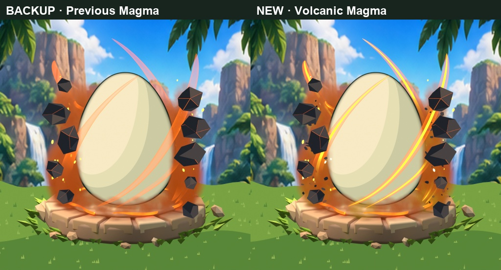
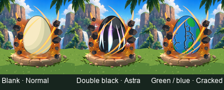

# Magma: multicolor heat and finer dark debris

The owner prefers the volcanic Magma revision and requests yellow alongside orange, plus smaller dark debris within the smoke rather than only major chunks. This new render revision is **awaiting owner review**. It does not change mutation IDs, rarity, other conditions, or runtime implementation.

Golden-yellow filaments run inside orange wisps; selected smoke pockets have golden heat; the ring has a yellow inner rim; and hot sparks vary between yellow and pale yellow. Seventy-four smaller irregular charcoal chips add detail through the side smoke and lower cloud, with varied sizes, elongation, depth, and rotation. Existing major rock chunks remain distinct.

[Larger combination review](magma_combination_review.jpg), [alpha/dimension/geometry validation](validation.json), [file hashes and provenance](manifest.json).

Local source: `Premium_Egg/Magma_Color_Debris/BeDino_Magma_Color_Debris.blend`. Backup: `BeDino_Magma_PreColor_Backup.blend`; the previous `Magma_Refinement` project/exports stay preserved. Full Blender/export files remain local, not downloadable from this evidence directory.

Eleven 1024px masters produce eleven actual 512px RGBA PNGs: three background scene checks, one combined aura, and separate smoke, wisps, major rocks, embers, fine debris, ground ring, and glow. Fine debris is separately editable and exported. Component passes exclude bloom; the glow pass uses Blender's compositor. Their independently evaluated volume overlaps may differ from the jointly rendered reference aura.

The camera and egg vertices are unchanged. Transparent components contain effect pixels only. The displayed combinations are checked at 128px; this is not an exhaustive pattern/Shiny/Big/animation or Roblox device performance acceptance.
