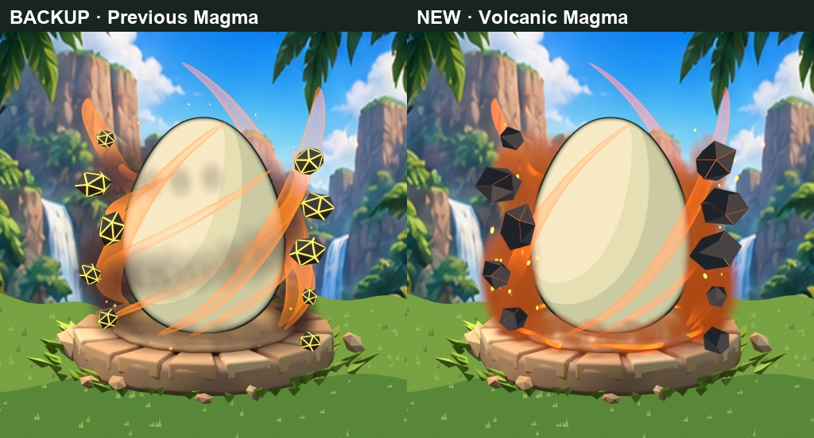
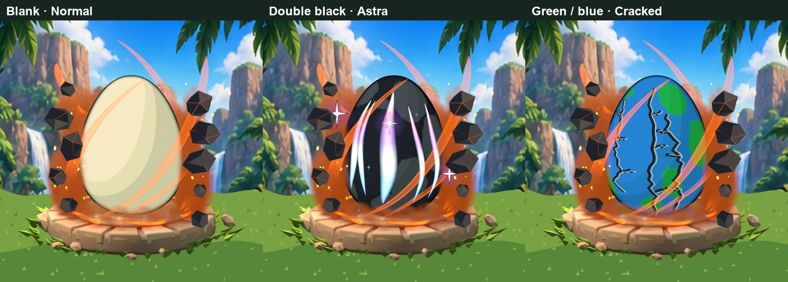
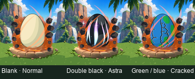
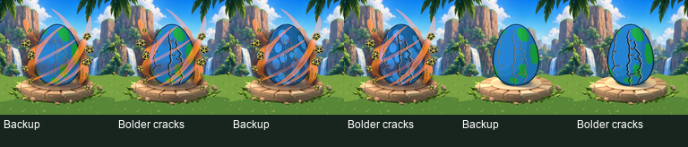

# Magma and Cracked authoring revisions — 2026-10-08

These revisions are **awaiting owner review**. They do not change gameplay IDs, rarity balance, or accepted Astra/Rainbow direction. Full editable projects and export packs remain local; the repository contains compact review evidence and validation records.

## Magma

Ten irregular floating rocks now use chunky, matte charcoal crust faces and narrow orange molten seams, replacing gold wireframe-looking fragments. Procedural heated smoke builds around the sides and floor; upper foreground soot is suppressed to preserve a clean Normal shell. Fewer/narrower crossing wisps, 34 small elongated ember particles, and a broken molten ground ring improve visual hierarchy. The stone tile, matching grass, jungle backdrop, original egg vertices, and locked camera remain preserved.

Local source: `Premium_Egg/Magma_Refinement/BeDino_Magma_Refined.blend`. Pre-edit project: `BeDino_Magma_Backup.blend`; original collection 204 stays hidden and intact. Collection 210 contains separately editable Smoke, Flame wisps, Rocks, Embers, and Ground ring collections.

Ten 1024px masters produce ten actual 512px RGBA exports: three background scene previews; one combined transparent aura; five component passes; and a separate compositor Fog Glow pass. Component passes exclude compositor bloom. Volume attenuation is evaluated separately per pass, so compositing all components is not guaranteed to exactly reproduce their joint render; use the combined aura as the reference appearance. Rear/front animation and runtime integration remain open.

[Magma validation](magma-validation.json): transparent corners across all seven effect/component exports; no opaque replacement egg; unchanged pixels outside the effect; identical camera transform; preserved egg vertex hash. Combined aura has only 0.37% opaque coverage within the canonical shell mask. This is a bounded test of the shown combinations, not all patterns, Shiny/Big, animation, or phone performance.

## Cracked

Dark fracture width increases from 0.012 to 0.025 Blender units. A muted pale chipped edge increases from 0.003 to 0.010, with wider offset and surface projection so it stays visible beside the dark core on double black. Existing dark branching paths are preserved; the original collection 60 stays hidden as backup. Revision collection 88 is separately editable and awaiting owner review.

Local source: `Premium_Egg/Cracked_Readability/BeDino_Bold_Cracked.blend`. [Larger comparison](cracked-before-after.jpg), [validation](cracked-validation.json): five 1024 masters/five 512 RGBA exports; reusable crack overlay covers 16.3% of the shell, has transparent corners, and preserves the base outside effect pixels. Egg vertices and camera are unchanged. This revision addresses the weak crack readability recorded in the earlier combination review; acceptance still requires owner review.

[File provenance and SHA-256 hashes](manifest.json).
