# Steal an Egg reference gallery

User-provided gameplay screenshots, captured 4 October 2026. These are design references, not Be Dino assets or Be Dino gameplay. Original game artwork remains its creators' work. Do not ship these images inside Be Dino.

| Screenshot | Screen | Useful pattern | Be Dino adaptation |
|---|---|---|---|
| [212704](reference-212704.png) | Gameplay HUD | Side navigation, large separate counters, coloured icon buttons | Dino Index, Eggs, Gold, Sanctuary, Settings; growth and catches |
| [212713](reference-212713.png) | Growing Eggs drawer | Compact title row and queue region | Five server-backed nest slots with live timers |
| [212719](reference-212719.png) | Active Pets drawer | Repeatable item rows, direct equip action | Owned dinosaur detail and equip action |
| [212727](reference-212727.png) | Boss Mastery | Current progress, reward milestones, clear claimed/locked states | Collection discovery and Gold copy progress |
| [212734](reference-212734.png) | Experiments | Large individual art, separate action strip, themed frame | Gold Fusion, with explicit consumption confirmation |
| [212744](reference-212744.png) | Pet Index | Cyan title, rarity grid, selected detail region | Dino Index and full detail screen |
| [212749](reference-212749.png) | Featured Shop | Large feature art with strong hierarchy | Sanctuary exploration hero; no invented purchases |
| [212757](reference-212757.png) | Currency Shop | Reusable art cards, value and action footer | Food-value guide and reward presentation |
| [212804](reference-212804.png) | Trail Shop | Common/rare colours, oversized product art | Base/Gold dinosaur presentation |
| [212810](reference-212810.png) | Sell Pets | Selection grid, sort/action zones | Collection browsing; no selling system added |
| [212815](reference-212815.png) | Sell Eggs | Shared layout across item types | Shared dinosaur/egg card design |
| [212827](reference-212827.png) | Offline banner | One strong highlighted value | Offline egg-growth message |
| [212837](reference-212837.png) | Roblox event dialog | Platform event card | Reference only; no event API imitation |

## Visual analysis

The screenshots consistently use near-black outlines, heavy white rounded text, saturated green/cyan/purple headers, squared frames with restrained rounding, dark stud-like panel textures, red close controls, dimensional item art, and high-contrast actions. Rarity and action colours repeat across screens. Collection cards make the item artwork the largest element, rather than a paragraph of explanation.

Static screenshots cannot establish exact animation timing, sounds, hover behaviour, or hatch effects. Be Dino's pop-in, hover, press, blur, confetti and progress feedback are independently implemented, not claims about footage we have not inspected.

We adapt the layout and visual language with original dinosaur-themed art and Be Dino's actual server logic. No Steal an Egg scripts, branded artwork, currency shop, paid products, or gameplay systems are copied into the game.

## Images

### reference-212704

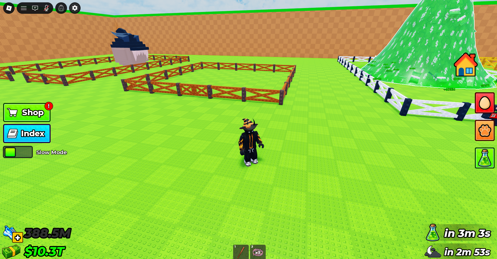

### reference-212713

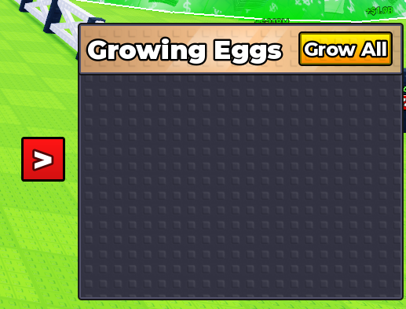

### reference-212719

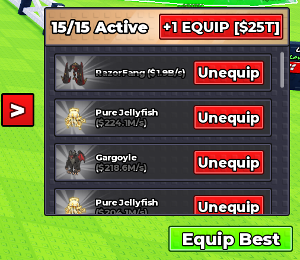

### reference-212727

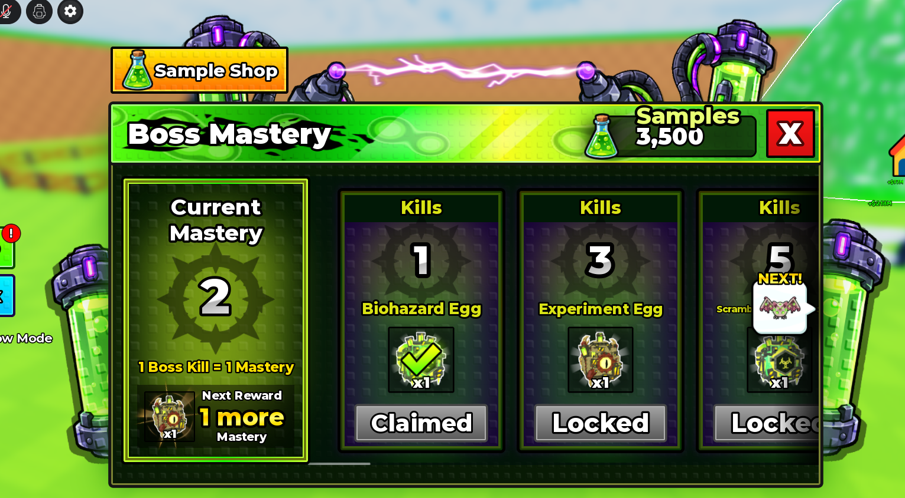

### reference-212734

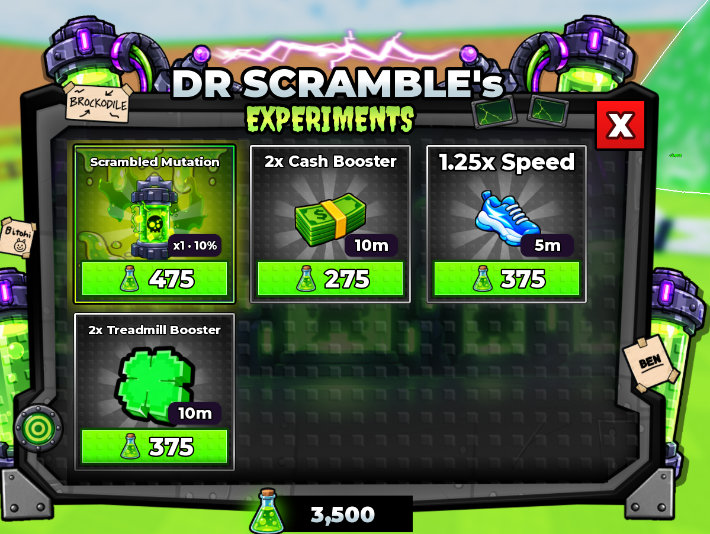

### reference-212744

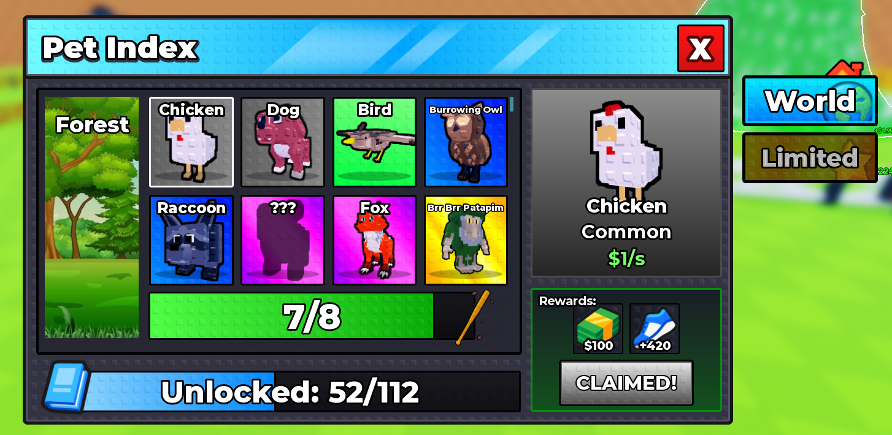

### reference-212749

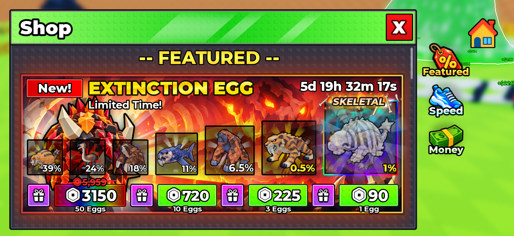

### reference-212757

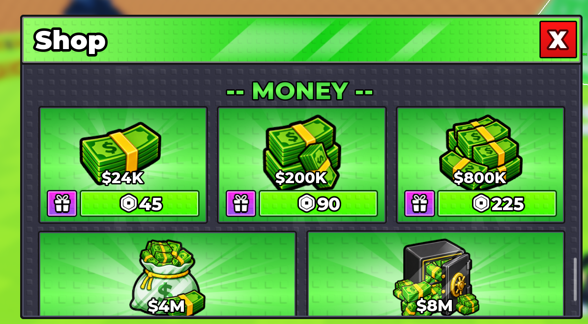

### reference-212804

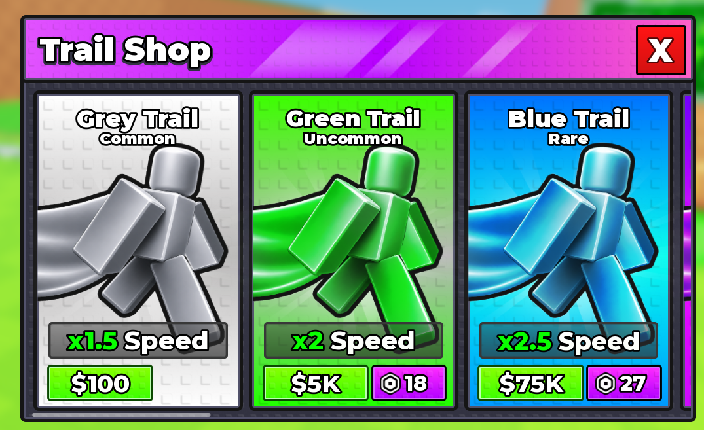

### reference-212810

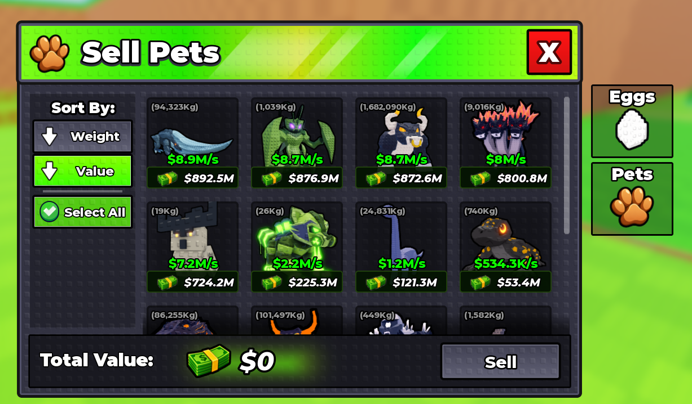

### reference-212815

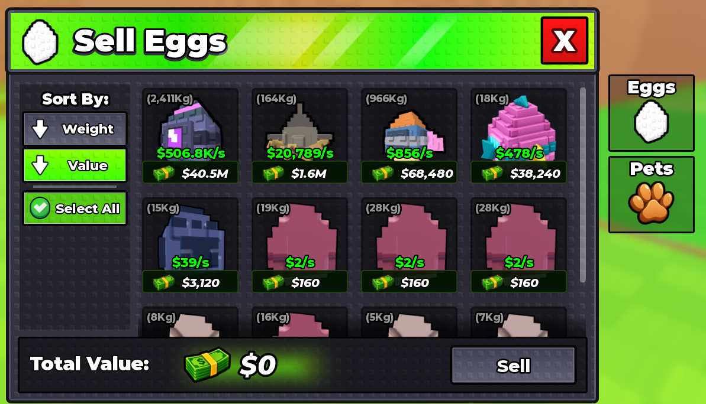

### reference-212827

### reference-212837

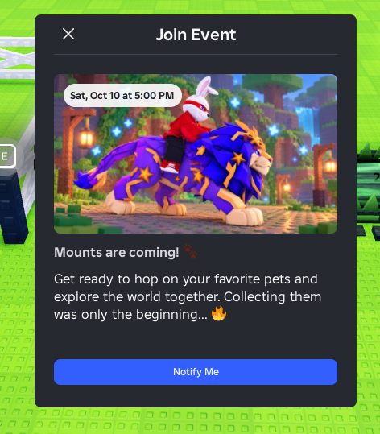
