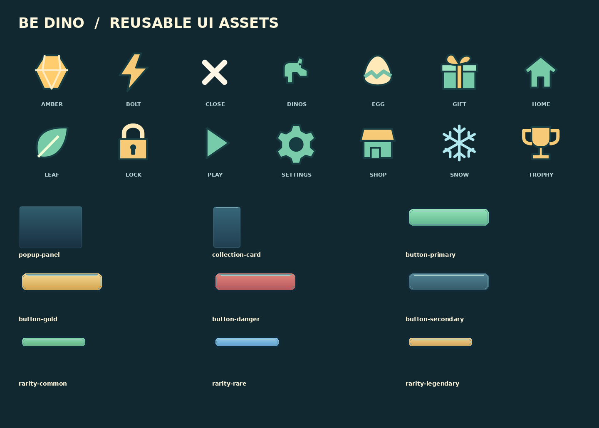
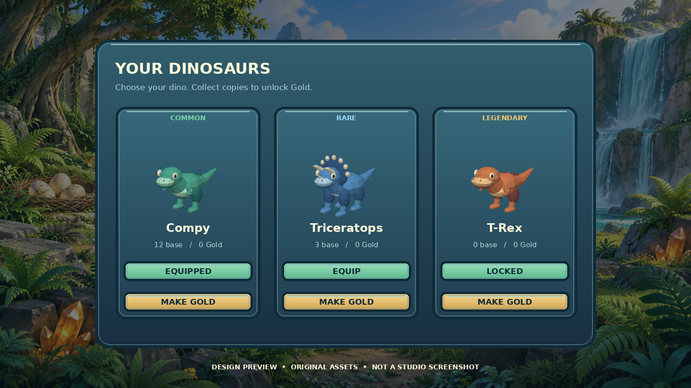

# Be Dino 2D assets

**Ready to inspect:** all artwork and exports below are committed PNG/SVG files.

## Collection menu design
This is a design preview assembled from the real model renders and UI assets, not a Studio screenshot.

## Icons
14 transparent PNGs at 256px, each with an editable SVG source.

| Icon | PNG | SVG |
|---|---|---|
| Dinosaurs | [dinos.png](icons/dinos.png) | [dinos.svg](icons/dinos.svg) |
| Egg | [egg.png](icons/egg.png) | [egg.svg](icons/egg.svg) |
| Crystal | [amber.png](icons/amber.png) | [amber.svg](icons/amber.svg) |
| Food leaf | [leaf.png](icons/leaf.png) | [leaf.svg](icons/leaf.svg) |
| Home | [home.png](icons/home.png) | [home.svg](icons/home.svg) |
| Play | [play.png](icons/play.png) | [play.svg](icons/play.svg) |
| Shop | [shop.png](icons/shop.png) | [shop.svg](icons/shop.svg) |
| Settings | [settings.png](icons/settings.png) | [settings.svg](icons/settings.svg) |
| Locked | [lock.png](icons/lock.png) | [lock.svg](icons/lock.svg) |
| Trophy | [trophy.png](icons/trophy.png) | [trophy.svg](icons/trophy.svg) |
| Gift | [gift.png](icons/gift.png) | [gift.svg](icons/gift.svg) |
| Speed | [bolt.png](icons/bolt.png) | [bolt.svg](icons/bolt.svg) |
| Blizzard | [snow.png](icons/snow.png) | [snow.svg](icons/snow.svg) |
| Close | [close.png](icons/close.png) | [close.svg](icons/close.svg) |

## Reusable components
PNG and editable SVG pairs under [components](components): popup panel, collection card, primary/gold/danger/secondary buttons, common/rare/legendary rarity chips. Text is kept native in-game so labels, translations and controls remain editable. The logo has its own [transparent PNG](components/be-dino-logo.png).

## Background and map reference
- [Illustrated prehistoric island background](backgrounds/prehistoric-island.png), generated with the built-in image tool. This is production artwork; it is not the 3D map itself.
- [Mountain island concept](../concepts/mountain-island.png), edited with the built-in image tool from the exact selected background. Used to direct the larger terrain, mountain paths, crystal food and egg-food direction.
- [Original source mesh render](../concepts/mesh-lineup.png).

## Runtime use
The 14 icon PNGs are compiled into `src/shared/IconRaster.luau`; the client can display them through EditableImage without invented uploaded IDs. `UITheme.ImageIds` accepts permanent Roblox uploads when available. Mesh sources are similarly embedded in `ResourceGeometry.luau` and created client-locally. Mesh/Image API permission or memory failures retain safe fallbacks and report status. Enable these APIs for a published experience or import/upload permanent assets.

Component PNGs are inspectable exports of the design system. Functional menus use native editable Frames/TextButtons/ViewportFrames rather than one flattened bitmap. The illustrated background needs a permanent Roblox image ID before using it as a full-resolution in-game loading background; the image file is present here for inspection now.

Rebuild: `python tools/design_ui.py`, then `python tools/compile_resources.py`, then `python tools/build.py`.
