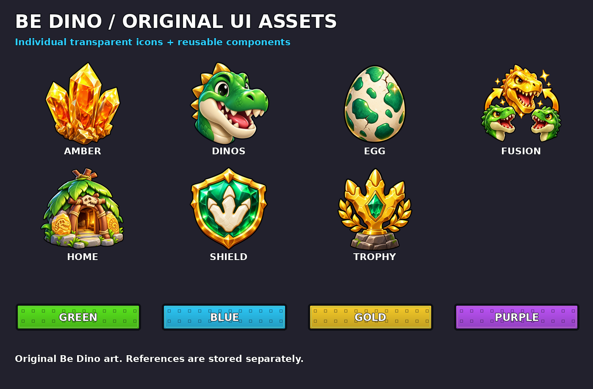
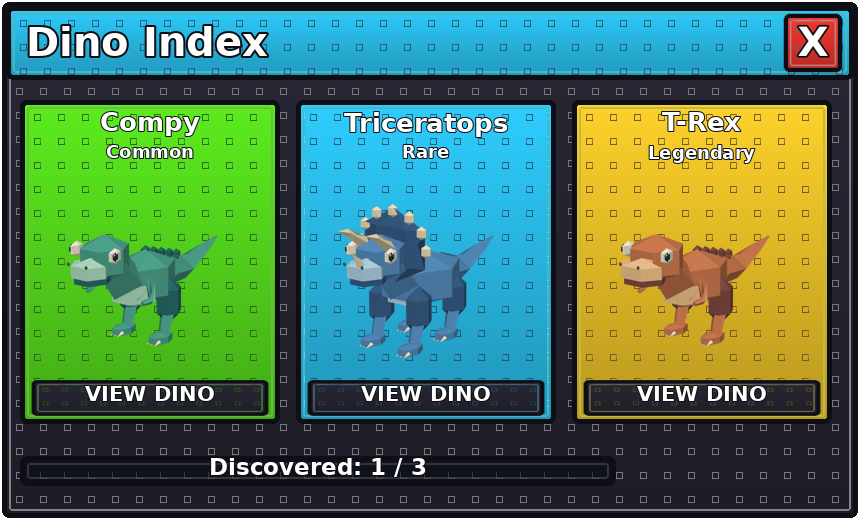

# Be Dino UI v2 assets

Original reusable Be Dino artwork, informed by the [user-provided reference gallery](../../references/steal-an-egg/README.md). These are individual assets, not flattened screen replacements.

## Individual transparent icons

| Asset | Use | Source |
|---|---|---|
| Dinosaur head | Dino Index navigation | [dinos.png](icons/dinos.png) |
| Prehistoric egg | Growing Eggs, hatch, empty nest | [egg.png](icons/egg.png) |
| Amber crystals | Growth counter, high-value food | [amber.png](icons/amber.png) |
| Sanctuary hut | Home and safe return | [home.png](icons/home.png) |
| Footprint trophy | Banked run results | [trophy.png](icons/trophy.png) |
| Gold fusion | Mutation progression and confirmation | [fusion.png](icons/fusion.png) |
| Safety shield | Settings/safety | [shield.png](icons/shield.png) |

All seven PNGs have genuine alpha transparency. Generated individually with the built-in image-generation tool. Prompt specifications are in [asset-prompts.json](asset-prompts.json). Full-resolution art is available for Roblox image upload; Build 018 uses the [sharp scalable graphics](scalable/README.md) and a native crystal model for reliable presentation without external image IDs.

## Reusable components

[components](components) contains separate header bars and buttons in green, blue, gold, purple, red and dark, common/rare/legendary card frames, a popup body, progress track, red close control, and transparent reward burst. Headers/buttons/cards have editable SVG sources and PNG exports. `tools/design_ui_v2.py` recreates the components and review sheets.

Native gameplay UI rebuilds these borders, gradients and patterns using Roblox GUI objects, with live text, actual 3D ViewportFrames and buttons connected to the existing server logic. These PNGs are reusable graphics for permanent asset upload or future tuning, not false screenshots of a tested game.

## Screen layout review

This is a design rendering using the actual source-model portraits, not a Roblox Studio screenshot. Fonts and lighting differ from engine rendering. Use [the complete screen checklist](../../../docs/28-ui-overhaul.md) to inspect every screen and its acceptance criteria.

## Production image binding

Upload individual `icons/*.png` under the experience owner. Set `UITheme.ImageIds` logical keys to the returned `rbxassetid://...` IDs. The icon helper then renders the full-quality ImageLabel in place of the scalable native graphics. No fabricated asset IDs are included.
