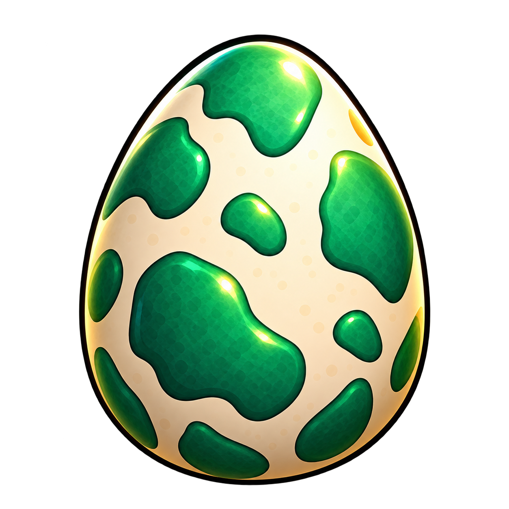
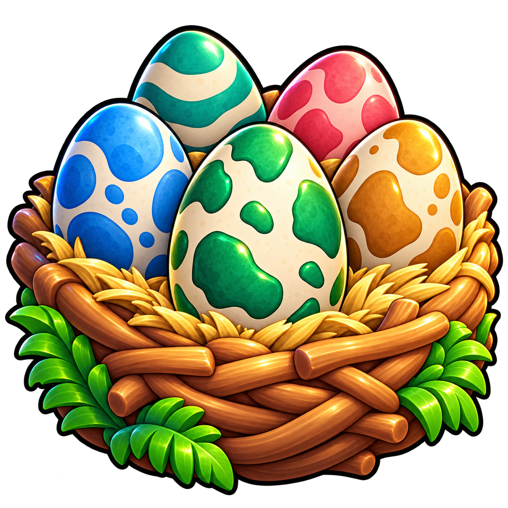

# Egg reward icons

Original Be Dino illustrations generated with built-in imagegen. Both PNGs have transparent backgrounds. Exact prompts and design context are in the adjacent JSON files.

| Asset | Use | Preview |
|---|---|---|
| [egg-green-v1.png](egg-green-v1.png) | One collectible egg; matches the nest's central egg |  |
| [egg-nest-v1.png](egg-nest-v1.png) | Separate timed reward bundle opened in the menu to reveal several eggs/dinosaurs |  |

Owner clarification, 2026-10-08: run rewards include individual eggs that hatch on screen after the run, crystals, and separate Egg Nests. Nests take time to open in the menu and reveal approximately 3–6 eggs/dinosaurs. More nests provide more hatches and opportunities for rarer dinosaurs; no rare result is guaranteed. Five illustrated eggs communicate a bundle rather than a fixed payout.

Keep timer, readiness, quantity and rarity labels in live UI, separate from the artwork. Preserve aspect ratio and use an inset when displaying the nest. The PNGs are reusable source artwork, not layered/vector files. Upload accepted assets under the experience owner and record real Roblox asset IDs during integration. GitHub availability does not establish Roblox upload or runtime integration.

Existing egg.png is preserved. These versioned assets do not change gameplay or replace current bindings automatically.
