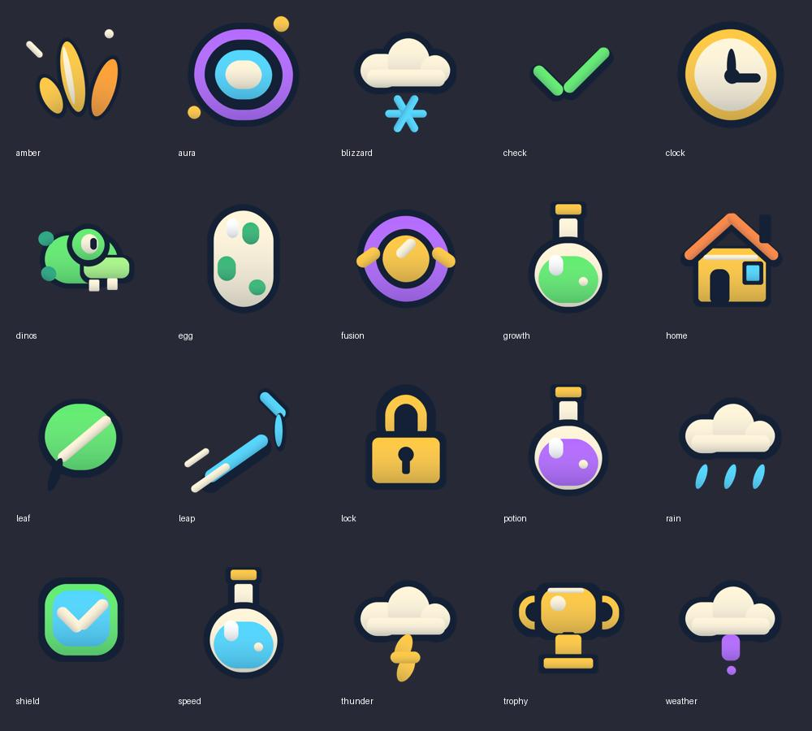

# Sharp scalable game icons

20 original individual icons with transparent 512px PNGs, editable SVGs and shared geometry.json. Native Roblox GUI primitives render the same geometry at its display size, avoiding enlarged 32px raster tiles and external image permission requirements. Existing full-resolution generated originals remain in ../icons and can override the vector style through UITheme.ImageIds after owner upload.

New system graphics: aura, leap, potion, speed, growth, rain, thunder, blizzard, weather (unknown), clock, lock and check. Existing navigation/currency graphics: home, trophy, dinos, egg, amber, fusion, shield and leaf.

Reproduce with python tools/design_game_icons.py (CairoSVG required). These are code-native original graphics, not AI-generated bitmap illustrations. Filenames map directly to IconVectors and UITheme logical keys. Aura product colours and rarity frames are applied dynamically.
